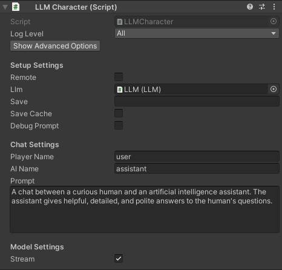

# Options (deprecated)
## LLM Settings

- `Show/Hide Advanced Options` Toggle to show/hide advanced options from below
- `Log Level` select how verbose the log messages are
- `Use extras` select to install and allow the use of extra features (flash attention and IQ quants)

## 💻 Setup Settings

- `Remote` select to provide remote access to the LLM
- `Port` port to run the LLM server (if `Remote` is set)
- `Num Threads` number of threads to use (default: -1 = all)
- `Num GPU Layers` number of model layers to offload to the GPU.
If set to 0 the GPU is not used. Use a large number i.e. >30 to utilise the GPU as much as possible.
Note that higher values of context size will use more VRAM.
If the user's GPU is not supported, the LLM will fall back to the CPU
- `Debug` select to log the output of the model in the Unity Editor
- 

Advanced options

  - 

<code>Parallel Prompts</code> number of prompts / slots that can happen in parallel (default: -1 = number of LLMCharacter objects). Note that the context size is divided among the slots.
 If you want to retain as much context for the LLM and don't need all the characters present at the same time, you can set this number and specify the slot for each LLMCharacter object.
  e.g. Setting `Parallel Prompts` to 1 and slot 0 for all LLMCharacter objects will use the full context, but the entire prompt will need to be computed (no caching) whenever a LLMCharacter object is used for chat. 

  - `Dont Destroy On Load` select to not destroy the LLM GameObject when loading a new Scene

## Server Security Settings

- `API key` API key to use to allow access to requests from LLMCharacter objects (if `Remote` is set)
- 

Advanced options

  - `Load SSL certificate` allows to load a SSL certificate for end-to-end encryption of requests (if `Remote` is set). Requires SSL key as well.
  - `Load SSL key` allows to load a SSL key for end-to-end encryption of requests (if `Remote` is set). Requires SSL certificate as well.
  - `SSL certificate path` the SSL certificate used for end-to-end encryption of requests (if `Remote` is set).
  - `SSL key path` the SSL key used for end-to-end encryption of requests (if `Remote` is set).

## 🤗 Model Settings
- `Download model` click to download one of the default models
- `Load model` click to load your own model in .gguf format
- `Download on Start` enable to downloaded the LLM models the first time the game starts. Alternatively the LLM models wil be copied directly in the build
- 

<code>Context Size</code> size of the prompt context (0 = context size of the model)
 This is the number of tokens the model can take as input when generating responses. Higher values use more RAM or VRAM (if using GPU). 

- 

Advanced options

  - `Download lora` click to download a LoRA model in .gguf format
  - `Load lora` click to load a LoRA model in .gguf format
  - `Batch Size` batch size for prompt processing (default: 512)
  - `Model` the path of the model being used (relative to the Assets/StreamingAssets folder)
  - `Chat Template` the chat template being used for the LLM
  - `Lora` the path of the LoRAs being used (relative to the Assets/StreamingAssets folder)
  - `Lora Weights` the weights of the LoRAs being used
  - `Flash Attention` click to use flash attention in the model (if `Use extras` is enabled)

## LLMCharacter Settings

- `Show/Hide Advanced Options` Toggle to show/hide advanced options from below
- `Log Level` select how verbose the log messages are
- `Use extras` select to install and allow the use of extra features (flash attention and IQ quants)

## 💻 Setup Settings

- `Remote` whether the LLM used is remote or local
- `LLM` the LLM GameObject (if `Remote` is not set)
- `Hort` ip of the LLM server (if `Remote` is set)
- `Port` port of the LLM server (if `Remote` is set)
- `Num Retries` number of HTTP request retries from the LLM server (if `Remote` is set)
- `API key` API key of the LLM server (if `Remote` is set)
- 

<code>Save</code> save filename or relative path
 If set, the chat history and LLM state (if save cache is enabled) is automatically saved to file specified.   The chat history is saved with a json suffix and the LLM state with a cache suffix.   Both files are saved in the [persistentDataPath folder of Unity](https://docs.unity3d.com/ScriptReference/Application-persistentDataPath.html).

- `Save Cache` select to save the LLM state along with the chat history. The LLM state is typically around 100MB+.
- `Debug Prompt` select to log the constructed prompts in the Unity Editor

## 🗨️ Chat Settings
- `Player Name` the name of the player
- `AI Name` the name of the AI
- `Prompt` description of the AI role

## 🤗 Model Settings
- `Stream` select to receive the reply from the model as it is produced (recommended!). 
If it is not selected, the full reply from the model is received in one go
- 

<code>Num Predict</code> maximum number of tokens to predict (default: 256, -1 = infinity, -2 = until context filled)
This is the maximum amount of tokens the model will maximum predict. When N tokens are reached the model will stop generating. This means words / sentences might not get finished if this is too low. 

- 

Advanced options

  - `Load grammar` click to load a grammar in .gbnf format
  - `Grammar` the path of the grammar being used (relative to the Assets/StreamingAssets folder)
  - 

<code>Cache Prompt</code> save the ongoing prompt from the chat (default: true)
 Saves the prompt while it is being created by the chat to avoid reprocessing the entire prompt every time

  - `Slot` slot of the server to use for computation. Value can be set from 0 to `Parallel Prompts`-1 (default: -1 = new slot for each character)
  - `Seed` seed for reproducibility. For random results every time use -1
  - 

<code>Temperature</code> LLM temperature, lower values give more deterministic answers (default: 0.2)
The temperature setting adjusts how random the generated responses are. Turning it up makes the generated choices more varied and unpredictable. Turning it down makes the generated responses more predictable and focused on the most likely options.

  - 

<code>Top K</code> top-k sampling (default: 40, 0 = disabled)
The top k value controls the top k most probable tokens at each step of generation. This value can help fine tune the output and make this adhere to specific patterns or constraints.

  - 

<code>Top P</code> top-p sampling (default: 0.9, 1.0 = disabled)
The top p value controls the cumulative probability of generated tokens. The model will generate tokens until this theshold (p) is reached. By lowering this value you can shorten output & encourage / discourage more diverse outputs.

  - 

<code>Min P</code> minimum probability for a token to be used (default: 0.05)
 The probability is defined relative to the probability of the most likely token.

  - 

<code>Repeat Penalty</code> control the repetition of token sequences in the generated text (default: 1.1)
The penalty is applied to repeated tokens.

  - 

<code>Presence Penalty</code> repeated token presence penalty (default: 0.0, 0.0 = disabled)
 Positive values penalize new tokens based on whether they appear in the text so far, increasing the model's likelihood to talk about new topics.

  - 

<code>Frequency Penalty</code> repeated token frequency penalty (default: 0.0, 0.0 = disabled)
 Positive values penalize new tokens based on their existing frequency in the text so far, decreasing the model's likelihood to repeat the same line verbatim.

  - `Typical P`: enable locally typical sampling with parameter p (default: 1.0, 1.0 = disabled).
  - `Repeat Last N`: last N tokens to consider for penalizing repetition (default: 64, 0 = disabled, -1 = ctx-size).
  - `Penalize Nl`: penalize newline tokens when applying the repeat penalty (default: true).
  - `Penalty Prompt`: prompt for the purpose of the penalty evaluation. Can be either `null`, a string or an array of numbers representing tokens (default: `null` = use original `prompt`).
  - `Mirostat`: enable Mirostat sampling, controlling perplexity during text generation (default: 0, 0 = disabled, 1 = Mirostat, 2 = Mirostat 2.0).
  - `Mirostat Tau`: set the Mirostat target entropy, parameter tau (default: 5.0).
  - `Mirostat Eta`: set the Mirostat learning rate, parameter eta (default: 0.1).
  - `N Probs`: if greater than 0, the response also contains the probabilities of top N tokens for each generated token (default: 0)
  - `Ignore Eos`: enable to ignore end of stream tokens and continue generating (default: false).

