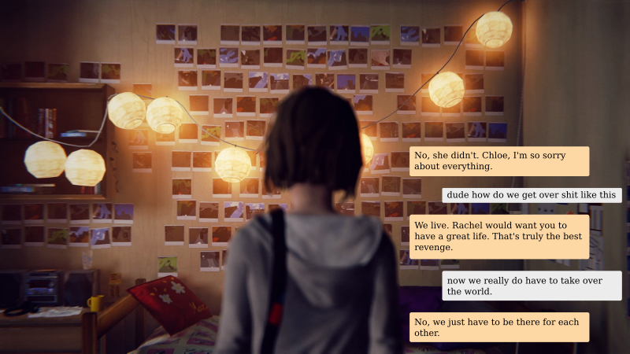
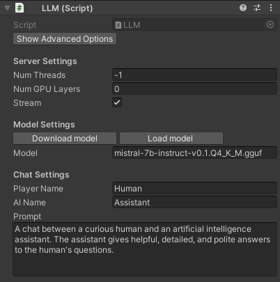

<p align="center">

</p>

<h3 align="center">Create characters in Unity with LLMs!</h3>

[](https://opensource.org/licenses/MIT)
<a href="https://discord.gg/RwXKQb6zdv"></a>
[](https://www.reddit.com/user/UndreamAI)
[](https://www.linkedin.com/company/undreamai)

LLM for Unity enables seamless integration of Large Language Models (LLMs) within the Unity engine.<br>
It allows to create intelligent characters that your players can interact with for an immersive experience.<br>
LLM for Unity is built on top of the awesome [llama.cpp](https://github.com/ggerganov/llama.cpp) and [llamafile](https://github.com/Mozilla-Ocho/llamafile) libraries.

<sub>
<a href="#at-a-glance" style="color: black">At a glance</a>&nbsp;&nbsp;•&nbsp;
<a href="#how-to-help" style=color: black>How to help</a>&nbsp;&nbsp;•&nbsp;
<a href="#games-using-llm-for-unity" style=color: black>Games using LLM for Unity</a>&nbsp;&nbsp;•&nbsp;
<a href="#setup" style=color: black>Setup</a>&nbsp;&nbsp;•&nbsp;
<a href="#how-to-use" style=color: black>How to use</a>&nbsp;&nbsp;•&nbsp;
<a href="#examples" style=color: black>Examples</a>&nbsp;&nbsp;•&nbsp;
<a href="#use-your-own-model" style=color: black>Use your own model</a>&nbsp;&nbsp;•&nbsp;
<a href="#options" style=color: black>Options</a>&nbsp;&nbsp;•&nbsp;
<a href="#license" style=color: black>License</a>
</sub>

## At a glance
- :computer: Cross-platform! Windows, Linux and macOS ([versions](https://github.com/Mozilla-Ocho/llamafile?tab=readme-ov-file#supported-oses))
- :house: Runs locally without internet access. No data ever leave the game!
- :zap: Blazing fast inference on CPU and GPU (Nvidia and AMD)
- :hugs: Support of the major LLM models ([models](https://github.com/ggerganov/llama.cpp?tab=readme-ov-file#description))
- :wrench: Easy to setup, call with a single line of code
- :moneybag: Free to use for both personal and commercial purposes

🧪 Tested on Unity: 2021 LTS, 2022 LTS, 2023<br>
:vertical_traffic_light: [Upcoming Releases](https://github.com/orgs/undreamai/projects/2/views/10)

## How to help
- Join us at [Discord](https://discord.gg/RwXKQb6zdv) and say hi!
- ⭐ Star the repo and spread the word about the project!
- Submit feature requests or bugs as [issues](https://github.com/undreamai/LLMUnity/issues) or even submit a PR and become a collaborator!

## Games using LLM for Unity
- [Verbal Verdict](https://store.steampowered.com/app/2778780/Verbal_Verdict/)

## Setup
_Method 1: Install using the asset store_
- Open the [LLM for Unity](https://assetstore.unity.com/packages/slug/273604) asset page and click `Add to My Assets`
- Open the Package Manager in Unity: `Window > Package Manager`
- Select the `Packages: My Assets` option from the drop-down
- Select the `LLM for Unity` package, click `Download` and then `Import`

_Method 2: Install using the GitHub repo:_
- Open the Package Manager in Unity: `Window > Package Manager`
- Click the `+` button and select `Add package from git URL`
- Use the repository URL `https://github.com/undreamai/LLMUnity.git` and click `Add`

On _macOS_ you need the Xcode Command Line Tools:
- From inside a terminal run `xcode-select --install`

## How to use
For a step-by-step tutorial you can have a look at our guide: 

<a href="https://towardsdatascience.com/how-to-use-llms-in-unity-308c9c0f637c">

</a>

[How to Use LLMs in Unity](https://towardsdatascience.com/how-to-use-llms-in-unity-308c9c0f637c)

The first step is to create a GameObject for the LLM :chess_pawn::
- Create an empty GameObject.<br>In the GameObject Inspector click `Add Component` and select the LLM script.
- Download one of the default models with the `Download Model` button (~GBs).<br>Or load your own .gguf model with the `Load model` button (see [Use your own model](#use-your-own-model)).
- Define the role of your AI in the `Prompt`. You can also define the name of the AI (`AI Name`) and the player (`Player Name`).
- (Optional) By default you receive the reply from the model as is it is produced in real-time (recommended).<br>If you want the full reply in one go, deselect the `Stream` option.
- (Optional) Adjust the server or model settings to your preference (see [Options](#options)).

In your script you can then use it as follows :unicorn::
``` c#
using LLMUnity;

public class MyScript {
  public LLM llm;
  
  void HandleReply(string reply){
    // do something with the reply from the model
    Debug.Log(reply);
  }
  
  void Game(){
    // your game function
    ...
    string message = "Hello bot!";
    _ = llm.Chat(message, HandleReply);
    ...
  }
}
```
You can also specify a function to call when the model reply has been completed.<br>
This is useful if the `Stream` option is selected for continuous output from the model (default behaviour):
``` c#
  void ReplyCompleted(){
    // do something when the reply from the model is complete
    Debug.Log("The AI replied");
  }
  
  void Game(){
    // your game function
    ...
    string message = "Hello bot!";
    _ = llm.Chat(message, HandleReply, ReplyCompleted);
    ...
  }
```

To stop the chat without waiting its completion you can use:
``` c#
    llm.CancelRequests();
```

- Finally, in the Inspector of the GameObject of your script, select the LLM GameObject created above as the llm property.

That's all :sparkles:!
<br><br>
You can also:


<details>
<summary>Build multiple characters</summary>

LLM for Unity allows to build multiple AI characters efficiently, where each character has it own prompt.<br>
See the [ServerClient](Samples~/ServerClient) sample for a server-client example.

To use multiple characters:
- create a single GameObject for the LLM as above for the first character.
- for every additional character create a GameObject using the LLMClient script instead of the LLM script.<br>
Define the prompt (and other parameters) of the LLMClient for the character

Then in your script:
``` c#
using LLMUnity;

public class MyScript {
  public LLM cat;
  public LLMClient dog;
  public LLMClient bird;
  
  void HandleCatReply(string reply){
    // do something with the reply from the cat character
    Debug.Log(reply);
  }

  void HandleDogReply(string reply){
    // do something with the reply from the dog character
    Debug.Log(reply);
  }

  void HandleBirdReply(string reply){
    // do something with the reply from the bird character
    Debug.Log(reply);
  }
  
  void Game(){
    // your game function
    ...
    _ = cat.Chat("Hi cat!", HandleCatReply);
    _ = dog.Chat("Hello dog!", HandleDogReply);
    _ = bird.Chat("Hiya bird!", HandleBirdReply);
    ...
  }
}
```

</details>
<details>
<summary>Process the prompt at the beginning of your app for faster initial processing time</summary>

``` c#
  void WarmupCompleted(){
    // do something when the warmup is complete
    Debug.Log("The AI is warm");
  }

  void Game(){
    // your game function
    ...
    _ = llm.Warmup(WarmupCompleted);
    ...
  }
```

</details>
<details>
<summary>Add or not the message to the chat/prompt history</summary>

  The last argument of the `Chat` function is a boolean that specifies whether to add the message to the history (default: true):
``` c#
  void Game(){
    // your game function
    ...
    string message = "Hello bot!";
    _ = llm.Chat(message, HandleReply, ReplyCompleted, false);
    ...
  }
```

</details>
<details>
<summary>Use pure text completion</summary>

``` c#
  void Game(){
    // your game function
    ...
    string message = "The cat is away";
    _ = llm.Complete(message, HandleReply, ReplyCompleted);
    ...
  }
```

</details>
<details>
<summary>Wait for the reply before proceeding to the next lines of code</summary>

  For this you can use the `async`/`await` functionality:
``` c#
  async void Game(){
    // your game function
    ...
    string message = "Hello bot!";
    string reply = await llm.Chat(message, HandleReply, ReplyCompleted);
    Debug.Log(reply);
    ...
  }
```

</details>
<details>
<summary>Add a LLM / LLMClient component dynamically</summary>

``` c#
using UnityEngine;
using LLMUnity;

public class MyScript : MonoBehaviour
{
    LLM llm;
    LLMClient llmclient;

    async void Start()
    {
        // Add and setup a LLM object
        gameObject.SetActive(false);
        llm = gameObject.AddComponent<LLM>();
        await llm.SetModel("mistral-7b-instruct-v0.2.Q4_K_M.gguf");
        llm.prompt = "A chat between a curious human and an artificial intelligence assistant.";
        gameObject.SetActive(true);

        // or a LLMClient object
        gameObject.SetActive(false);
        llmclient = gameObject.AddComponent<LLMClient>();
        llmclient.prompt = "A chat between a curious human and an artificial intelligence assistant.";
        gameObject.SetActive(true);
    }
}
```

</details>
<details>
<summary>Use a remote server</summary>

You can also build a remote server that does the processing and have local clients that interact with it.To do that:
- Create a server based on the `LLM` script or a standard [llama.cpp server](https://github.com/ggerganov/llama.cpp/blob/master/examples/server).
- If using the `LLM` script for the server, enable the `Remote` option (Advanced options)
- Create characters with the `LLMClient` script. The characters can be configured to connect to the remote instance by providing the IP address (starting with "http://") and port of the server in the `host`/`port` properties.

</details>


## Examples
The [Samples~](Samples~) folder contains several examples of interaction :robot::
- [SimpleInteraction](Samples~/SimpleInteraction): Demonstrates simple interaction between a player and a AI
- [ServerClient](Samples~/ServerClient): Demonstrates simple interaction between a player and multiple AIs using a `LLM` and a `LLMClient`
- [ChatBot](Samples~/ChatBot): Demonstrates interaction between a player and a AI with a UI similar to a messaging app (see image below)
  


To install a sample:
- Open the Package Manager: `Window > Package Manager`
- Select the `LLM for Unity` Package. From the `Samples` Tab, click `Import` next to the sample you want to install.

The samples can be run with the `Scene.unity` scene they contain inside their folder.<br>
In the scene, select the `LLM` GameObject and click the `Download Model` button to download the default model.<br>
You can also load your own model in .gguf format with the `Load model` button (see [Use your own model](#use-your-own-model)).<br>
Save the scene, run and enjoy!

## Use your own model
LLM for Unity uses the [Mistral 7B Instruct](https://huggingface.co/mistralai/Mistral-7B-Instruct-v0.2), [OpenHermes 2.5](https://huggingface.co/teknium/OpenHermes-2.5-Mistral-7B) or [Microsoft Phi-2](https://huggingface.co/microsoft/phi-2) model by default, quantised with the Q4 method.<br>

Alternative models can be downloaded from [HuggingFace](https://huggingface.co/models).<br>
The models should be able to use the ChatML prompt format as this is hardcoded at the moment in llama.cpp.<br>
The required model format is .gguf as defined by the llama.cpp.<br>
The easiest way is to download gguf models directly by [TheBloke](https://huggingface.co/TheBloke) who has converted an astonishing number of models :rainbow:!<br>
Otherwise other model formats can be converted to gguf with the `convert.py` script of the llama.cpp as described [here](https://github.com/ggerganov/llama.cpp/tree/master?tab=readme-ov-file#prepare-data--run).<br>

:grey_exclamation: Before using any model make sure you **check their license** :grey_exclamation:

## Options

- `Show/Hide Advanced Options` Toggle to show/hide advanced options from below
- `Show/Hide Expert Options` Toggle to show/hide expert options from below

#### :computer: Server Settings

<div>

</div>

- `Num Threads` number of threads to use (default: -1 = all)
- `Num GPU Layers` number of model layers to offload to the GPU.
If set to 0 the GPU is not used. Use a large number i.e. >30 to utilise the GPU as much as possible.
If the user's GPU is not supported, the LLM will fall back to the CPU
- `Stream` select to receive the reply from the model as it is produced (recommended!).<br>
If it is not selected, the full reply from the model is received in one go
- <details><summary>Advanced options</summary>

  - `Parallel Prompts` number of prompts that can happen in parallel (default: -1 = number of LLM/LLMClient objects)
  - `Debug` select to log the output of the model in the Unity Editor
  - `Asynchronous Startup` allows to start the server asynchronously
  - `Remote` select to allow remote access to the server
  - `Port` port to run the server
  - `Kill Existing Servers On Start` kills existing servers by the Unity project on startup to handle Unity crashes

</details>

#### :hugs: Model Settings
- `Download model` click to download one of the default models
- `Load model` click to load your own model in .gguf format
- `Model` the model being used (inside the Assets/StreamingAssets folder)
- <details><summary><code>Chat Template</code> the chat template to use for constructing the prompts</summary> The chat template is determined automatically by the chat template of the model (if it exists) or the model name. The "chatml" and "alpaca" templates work with most of the models.</details>
- <details><summary>Advanced options</summary>

  - `Load lora` click to load a LORA model in .bin format
  - `Load grammar` click to load a grammar in .gbnf format
  - `Lora` the LORA model being used (inside the Assets/StreamingAssets folder)
  - `Grammar` the grammar being used (inside the Assets/StreamingAssets folder)
  - `Context Size` Size of the prompt context (0 = context size of the model)
  - `Batch Size` Batch size for prompt processing (default: 512)
  - `Seed` seed for reproducibility. For random results every time select -1
  - <details><summary><code>Cache Prompt</code> save the ongoing prompt from the chat (default: true)</summary> Saves the prompt as it is being created by the chat to avoid reprocessing the entire prompt every time</details>
  - <details><summary><code>Num Predict</code> number of tokens to predict (default: 256, -1 = infinity, -2 = until context filled)</summary>This is the amount of tokens the model will maximum predict. When N predict is reached the model will stop generating. This means words / sentences might not get finished if this is too low. </details>
  - <details><summary><code>Temperature</code> LLM temperature, lower values give more deterministic answers</summary>The temperature setting adjusts how random the generated responses are. Turning it up makes the generated choices more varied and unpredictable. Turning it down  makes the generated responses more predictable and focused on the most likely options.</details>
  - <details><summary><code>Top K</code> top-k sampling (default: 40, 0 = disabled)</summary>The top k value controls the top k most probable tokens at each step of generation. This value can help fine tune the output and make this adhere to specific patterns or constraints.</details>
  - <details><summary><code>Top P</code> top-p sampling (default: 0.9, 1.0 = disabled)</summary>The top p value controls the cumulative probability of generated tokens. The model will generate tokens until this theshold (p) is reached. By lowering this value you can shorten output & encourage / discourage more diverse output.</details>
  - <details><summary><code>Min P</code> minimum probability for a token to be used (default: 0.05)</summary> The probability is defined relative to the probability of the most likely token.</details>
  - <details><summary><code>Repeat Penalty</code> Control the repetition of token sequences in the generated text (default: 1.1)</summary>The penalty is applied to repeated tokens.</details>
  - <details><summary><code>Presence Penalty</code> repeated token presence penalty (default: 0.0, 0.0 = disabled)</summary> Positive values penalize new tokens based on whether they appear in the text so far, increasing the model's likelihood to talk about new topics.</details>
  - <details><summary><code>Frequency Penalty</code> repeated token frequency penalty (default: 0.0, 0.0 = disabled)</summary> Positive values penalize new tokens based on their existing frequency in the text so far, decreasing the model's likelihood to repeat the same line verbatim.</details>
- <details><summary>Expert options</summary>

  - `tfs_z`: Enable tail free sampling with parameter z (default: 1.0, 1.0 = disabled).
  - `typical_p`: Enable locally typical sampling with parameter p (default: 1.0, 1.0 = disabled).
  - `repeat_last_n`: Last n tokens to consider for penalizing repetition (default: 64, 0 = disabled, -1 = ctx-size).
  - `penalize_nl`: Penalize newline tokens when applying the repeat penalty (default: true).
  - `penalty_prompt`: Prompt for the purpose of the penalty evaluation. Can be either `null`, a string or an array of numbers representing tokens (default: `null` = use original `prompt`).
  - `mirostat`: Enable Mirostat sampling, controlling perplexity during text generation (default: 0, 0 = disabled, 1 = Mirostat, 2 = Mirostat 2.0).
  - `mirostat_tau`: Set the Mirostat target entropy, parameter tau (default: 5.0).
  - `mirostat_eta`: Set the Mirostat learning rate, parameter eta (default: 0.1).
  - `n_probs`: If greater than 0, the response also contains the probabilities of top N tokens for each generated token (default: 0)
  - `ignore_eos`: Ignore end of stream token and continue generating (default: false).

    </details>

</details>

#### :left_speech_bubble: Chat Settings
- `Player Name` the name of the player
- `AI Name` the name of the AI
- `Prompt` a description of the AI role

## License
The license of LLM for Unity is MIT ([LICENSE.md](LICENSE.md)) and uses third-party software with MIT and Apache licenses ([Third Party Notices.md](<Third Party Notices.md>)).
