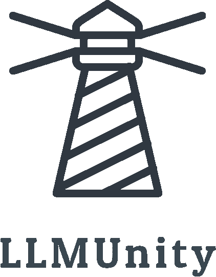

<p align="center">

</p>

<h3 align="center">Integrate LLM models in Unity!</h3>
<br>
LLMUnity allows to integrate, run and deploy LLMs (Large Language Models) in the Unity engine.<br>

LLMUnity is built on top of the awesome [llama.cpp](https://github.com/ggerganov/llama.cpp) and [llamafile](https://github.com/Mozilla-Ocho/llamafile) libraries.

## At a glance
- :computer: Cross-platform! Supports Windows, Linux and macOS ([supported versions](https://github.com/Mozilla-Ocho/llamafile?tab=readme-ov-file#supported-oses-and-cpus))
- :house: Runs locally without internet access but also supports remote servers
- :zap: Fast inference on CPU and GPU
- :hugs: Support of the major LLM models ([supported models](https://github.com/ggerganov/llama.cpp?tab=readme-ov-file#description))
- :wrench: Easy to setup, call with a single line code
- :moneybag: Free to use for both personal and commercial purposes

[:vertical_traffic_light: Feature Backlog](https://github.com/orgs/undreamai/projects/2/views/1)

## Setup
To install the package you can follow the typical asset / package process in Unity:<br>

_Method 1: Install the asset using the asset store_
- Open the [LLMUnity](https://assetstore.unity.com/packages/slug/273604) asset page and click `Add to My Assets`
- Open the Package Manager: `Window > Package Manager`
- Select the `Packages: My Assets` option from the drop-down
- Select the `LLMUnity` package, click `Download` and then `Import`

_Method 2: Install the asset using the GitHub repo:_
- Open the Package Manager: `Window > Package Manager`
- Click the `+` button and select `Add package from git URL`
- Use the repository URL `https://github.com/undreamai/LLMUnity.git` and click `Add`

## How to use
Create a GameObject for the LLM :chess_pawn::
- Create an empty GameObject. In the GameObject Inspector click `Add Component` and select the LLM script (`Scripts>LLM`).
- Download the default model with the `Download Model` button (this will take a while as it is ~4GB).<br>You can also load your own model in .gguf format with the `Load model` button (see [Use your own model](#use-your-own-model)).
- Define the role of your AI in the `Prompt`. You can also define the name of the AI (`AI Mame`) and the player (`Player Name`).
- (Optional) By default the LLM script is set up to receive the reply from the model as is it is produced in real-time (recommended). If you prefer to receive the full reply in one go, you can deselect the `Stream` option.
- (Optional) Adjust the server or model settings to your preference (see [Options](#options)).
<br>

In your script you can then use it as follows :unicorn::
``` c#
public class MyScript {
  public LLM llm;
  
  void HandleReply(string reply){
    // do something with the reply from the model
    Debug.Log(reply);
  }
  
  void Game(){
    // your game function
    ...
    string message = "Hello bot!"
    _ = llm.Chat(message, HandleReply);
    ...
  }
}
```
You can also specify a function to call when the model reply has been completed.<br>
This is useful if the `Stream` option is selected for continuous output from the model (default behaviour):
``` c#
  void ReplyCompleted(){
    // do something when the reply from the model is complete
    Debug.Log("The AI replied");
  }
  
  void Game(){
    // your game function
    ...
    string message = "Hello bot!"
    _ = llm.Chat(message, HandleReply, ReplyCompleted);
    ...
  }
```

- Finally, in the Inspector of the GameObject of your script, select the LLM GameObject created above as the llm property.

That's all :sparkles:!
<br><br>
You can also:


<details>
<summary>Wait for the reply before proceeding to the next lines of code</summary>

  For this you can use the `async`/`await` functionality:
``` c#
  async void Game(){
    // your game function
    ...
    string message = "Hello bot!"
    await llm.Chat(message, HandleReply, ReplyCompleted);
    ...
  }
```

</details>
<details>
<summary>Process the prompt at the beginning of your app for faster initial processing time</summary>

``` c#
  void WarmupCompleted(){
    // do something when the warmup is complete
    Debug.Log("The AI is warm");
  }

  void Game(){
    // your game function
    ...
    _ = llm.Warmup(WarmupCompleted);
    ...
  }
```

</details>

## Examples
The [Samples~](Samples~) folder contains several examples of interaction :robot::
- [SimpleInteraction](Samples~/SimpleInteraction): Demonstrates simple interaction between a player and a AI
- [ServerClient](Samples~/ServerClient): Demonstrates simple interaction between a player and multiple AIs using a `LLM` and a `LLMClient`
- [ChatBot](Samples~/ChatBot): Demonstrates interaction between a player and a AI with a UI similar to a messaging app (see image below)
  


If you install the package as an asset, the samples will already be in the `Assets/Samples` folder.<br>
Otherwise if you install it with the GitHub URL, to install a sample:
- Open the Package Manager: `Window > Package Manager`
- Select the `LLMUnity` Package. From the `Samples` Tab, click `Import` next to the sample you want to install.

The samples can be run with the `Scene.unity` scene they contain inside their folder.<br>
In the scene, select the `LLM` GameObject and click the `Download Model` button to download the default model.<br>
You can also load your own model in .gguf format with the `Load model` button (see [Use your own model](#use-your-own-model)).<br>
Save the scene, run and enjoy!


## Use your own model
Alternative models can be downloaded from [HuggingFace](https://huggingface.co/models).<br>
The required model format is .gguf as defined by the llama.cpp.<br>
The easiest way is to download gguf models directly by [TheBloke](https://huggingface.co/TheBloke) who has converted an astonishing number of models :rainbow:!<br>
Otherwise other model formats can be converted to gguf with the `convert.py` script of the llama.cpp as described [here](https://github.com/ggerganov/llama.cpp/tree/master?tab=readme-ov-file#prepare-data--run).

:grey_exclamation: Before using any model make sure you **check their license** :grey_exclamation:

## Multiple client / Remote server setup
In addition to the `LLM` server functionality, LLMUnity defines the `LLMClient` client class that handles the client functionality.<br>
The `LLMClient` contains a subset of options of the `LLM` class described in the [Options](#options).<br>
It can be used to have multiple clients with different options e.g. different prompts that use the same server.<br>
This is important as multiple server instances would require additional compute resources.<br>
To use multiple instances, you can define one `LLM` GameObject (as described in [How to use](#how-to-use)) and then multiple `LLMClient` objects.
See the [ServerClient](Samples~/ServerClient) sample for a server-client example.

The `LLMClient` can be configured to connect to a remote instance by providing the IP address of the server in the `host` property.<br>
The server can be either a LLMUnity server or a standard [llama.cpp server](https://github.com/ggerganov/llama.cpp/blob/master/examples/server).

## Options

#### :computer: Server Settings

<div>

</div>

- `Num Threads` number of threads to use (default: -1 = all)
- `Num GPU Layers` number of model layers to offload to the GPU.
If set to 0 the GPU is not used. Use a large number i.e. >30 to utilise the GPU as much as possible.<br>
If the user's GPU is not supported, the LLM will fall back to the CPU
- `Debug` select to log the output of the model in the Unity Editor
- `Port` port to run the server
- `Stream` select to receive the reply from the model as it is produced (recommended!).<br>
If it is not selected, the full reply from the model is received in one go

#### :hugs: Model Settings
- `Download model` click to download the default model (Mistral 7B Instruct)
- `Load model` click to load your own model in .gguf format
- `Load lora` click to load a LORA model in .bin format
- `Model` the model being used (inside the Assets/StreamingAssets folder)
- `Lora` the LORA model being used (inside the Assets/StreamingAssets folder)
- `Context Size` Size of the prompt context (0 = context size of the model)
- `Batch Size` Batch size for prompt processing (default: 512)
- `Seed` seed for reproducibility. For random results every time select -1
- `Temperature` LLM temperature, lower values give more deterministic answers
- `Top K` top-k sampling (default: 40, 0 = disabled)
- `Top P` top-p sampling (default: 0.9, 1.0 = disabled)
- `Num Predict` number of tokens to predict (default: 256, -1 = infinity, -2 = until context filled)

#### :left_speech_bubble: Chat Settings
- `Player Name` the name of the player
- `AI Name` the name of the AI
- `Prompt` a description of the AI role

## License
The license of LLMUnity is MIT ([LICENSE.md](LICENSE.md)) and uses third-party software with MIT and Apache licenses ([Third Party Notices.md](<Third Party Notices.md>)).
