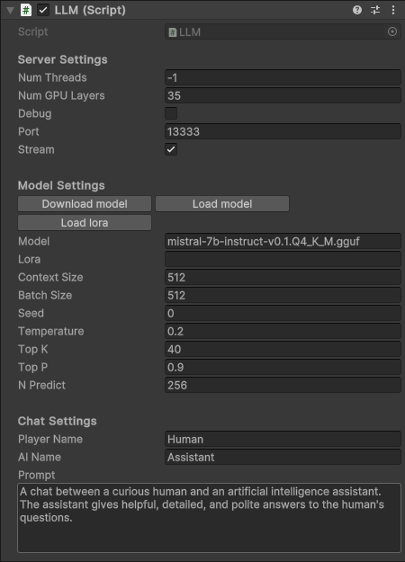

<p align="center">

</p>

<h3 align="center">Run and deploy LLM models in Unity!</h3>

LLMUnity allows to run and distribute LLM models in the Unity engine.
<br>
LLMUnity is built on top of the awesome [llama.cpp](https://github.com/ggerganov/llama.cpp) and [llamafile](https://github.com/Mozilla-Ocho/llamafile) libraries.

## Features


- :computer: Cross-platform! Supports Windows, Linux and macOS ([supported versions](https://github.com/Mozilla-Ocho/llamafile?tab=readme-ov-file#supported-oses-and-cpus))
- :house: Runs locally without need of internet access but also supports remote servers
- :zap: Real-time inference on CPU or Nvidia GPUs
- :hugs: Support of the major LLM models ([supported models](https://github.com/ggerganov/llama.cpp?tab=readme-ov-file#description))!
- :wrench: Easy to setup, call with a single line code
- :moneybag: Free to use for both personal and commercial purposes!


<br clear="right"/>

## Setup

- Install the asset in Unity
- Create an empty GameObject. In the GameObject Inspector press "Add Component" and select the LLM script ("Scripts">"LLM").
- Download the default model with the "Download Model" button.<br>You can also load your own model in .gguf format with the "Load model" button (see [Use your own model](#use-your-own-model)).
- Define the role of your AI in the "Prompt". You can optionally specify the player and the AI name.
- (Optional) Adjust the server or model settings to your preference (see [Options](#options)).

<br>

- In your script you can then use it as follows:


``` c#
public class MyScript {
  LLM llm;
  
  void HandleReply(string reply){
    // do something with the reply from the model
    Debug.Log(reply);
  }
  
  void Game(){
    // your game function
    ...
    string message = "Hello bot!"
    Task chatTask = llmClient.Chat(message, HandleReply);
    ...
  }
}
```

- (Optional) You can also specify a function that is called when the model reply has finished. <br>This is useful if you select the Stream option for continuous output from the model (see [Options](#options)):
``` c#
  void ReplyCompleted(){
    // do something when the reply from the model is complete
    Debug.Log("The AI replied");
  }
  
  void Game(){
    // your game function
    ...
    string message = "Hello bot!"
    Task chatTask = llmClient.Chat(message, HandleReply, ReplyCompleted);
    ...
  }
```

- In the Inspector of the GameObject of your script, select the LLM GameObject created above as the llm property.

<br>

That's all :sparkles:!


## Options

<div>

</div>

#### :computer: Server Settings
- `Num Threads` number of threads to use (default: -1 = all)
- `Num GPU Layers` number of model layers to offload to the GPU.
If set to 0 the GPU is not used. Use a large number i.e. >30 to utilise the GPU as much as possible.<br>
If no Nvidia GPU exists in the user, the LLM will fall back to the CPU
- `Debug` select to log the output of the model in the Unity Editor
- `Port` port to run the server
- `Stream` select to receive the reply from the model as it is produced.<br>
If it is not selected, the full reply from the model is received in one go

#### :hugs: Model Settings
- `Download model` click to download the default model (Mistral 7B Instruct)
- `Load model` click to load your own model in .gguf format
- `Load lora` click to load a LORA model in .bin format
- `Model` the model being used (inside the Assets/StreamingAssets folder)
- `Lora` the LORA model being used (inside the Assets/StreamingAssets folder)
- `Context Size` Size of the prompt context
- `Batch Size` Batch size for prompt processing (default: 512)
- `Seed` seed for reproducibility. For random results every time select -1
- `Temperature` LLM temperature, lower values give more deterministic answers
- `Top K` top-k sampling (default: 40, 0 = disabled)
- `Top P` top-p sampling (default: 0.9, 1.0 = disabled)
- `Num Predict` number of tokens to predict (default: 256, -1 = infinity, -2 = until context filled)

#### :left_speech_bubble: Chat Settings
- `Player Name` the name of the player
- `AI Name` the name of the AI
- `Prompt` a description of the AI role


<br clear="right"/>

## Use your own model

A vast amount of models are available from [TheBloke](https://huggingface.co/TheBloke). Make sure to check the license before using any model!

## Remote server / Multiple client setup
## License
## Author
## Disclaimers
