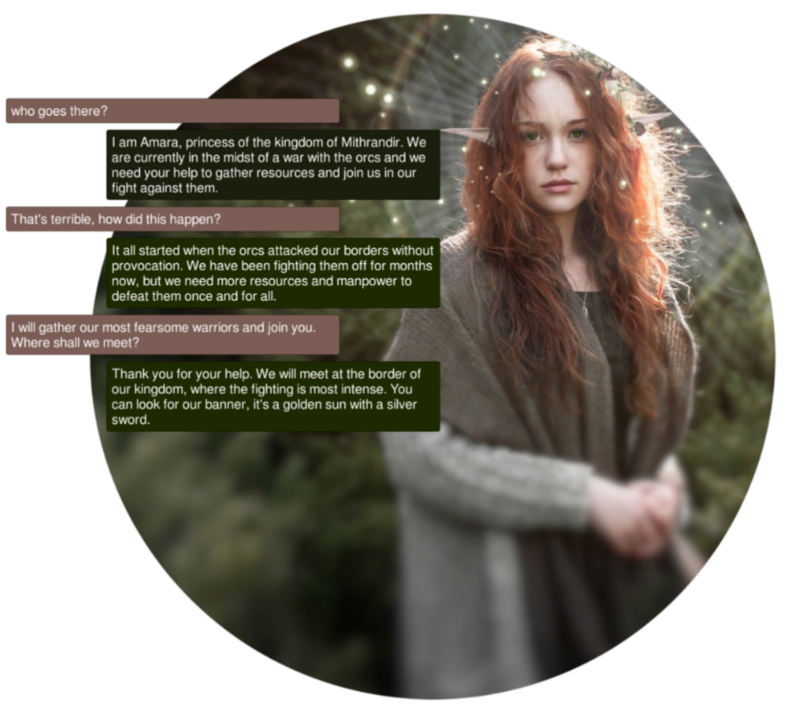
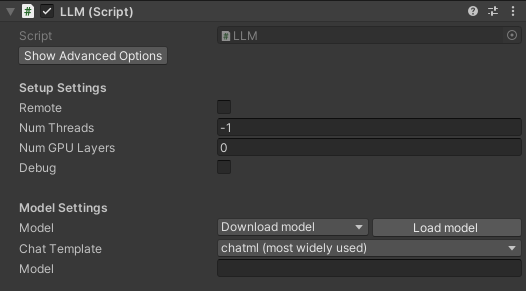
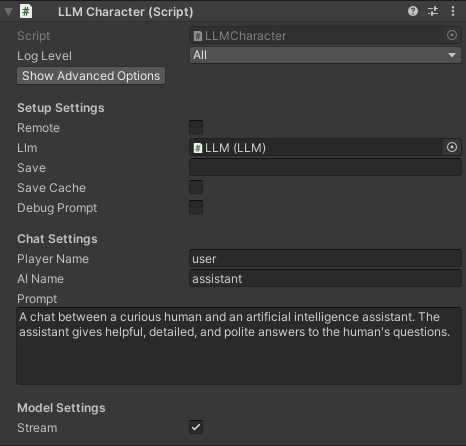

<p align="center">
<picture>
  <source media="(prefers-color-scheme: dark)" srcset=".github/logo_white.png">
  <source media="(prefers-color-scheme: light)" srcset=".github/logo.png">
  
</picture>
</p>

<h3 align="center">Create characters in Unity with LLMs!</h3>

[](https://opensource.org/licenses/MIT)
<a href="https://discord.gg/RwXKQb6zdv"></a>
[](https://www.reddit.com/user/UndreamAI)
[](https://www.linkedin.com/company/undreamai)
[](https://assetstore.unity.com/packages/slug/273604)
[](https://github.com/undreamai/LLMUnity)
[![Documentation](https://img.shields.io/badge/Docs-white.svg?logo=data:image/png;base64,iVBORw0KGgoAAAANSUhEUgAAADAAAAAwEAYAAAAHkiXEAAAABHNCSVQICAgIfAhkiAAAAAlwSFlzAAALEgAACxIB0t1+/AAAABl0RVh0U29mdHdhcmUAd3d3Lmlua3NjYXBlLm9yZ5vuPBoAAATqSURBVHic7ZtbiE1RGMc349K4M5EwklwjzUhJCMmTJPJAYjQXJJcH8+Blkry4lPJA8aAoJbekDLmUS6E8SHJL5AW5JPf77eHv93C22Wfttc/ee+0zc/4vv+bMXvusvfZa3/q+b33H80oqqaSSSmqrKnPdgXjUvbvYq5f4+7f486eb/rRajRsn7t4tPngg/vol/vkj/vghXr0q7tghzpyZ//79+on79omXLombNondukXrd9GoSxdx8mSxqUm8eVNkgAvl0aPioEFip07i6dP52z15Ig4fbvVY2VVFhbhokXjrlogJiWvAg/jwoXjqVO73+leUny9eiFVV5mfMlLDRBw+KX76ISQ+0LZ8/F00v4uJFsWPHFh83O+rdWzx3TnQ9wCZ+/Sqyl5iux1RmTu3aiYcPi64H1pasALypoOv4/8SJXraEbXc9kLbECxo2TKyuFj9/zt9u+XIvG8LWv3wpuh5QW86f3/JznT+fv93s2S23C1Z72wbhtH692LdvMvdPSgzkhAkiJhT16ZO/PRPOmcr+Rda4aa5nclTeuZP7PDgRpr1g40bPrQYOFF0PYKHEC+raVVy8OFy7R49EArvURU4mrUAqaTY0iB8/2rXD+XCm5mbR9QAWylevorV7/VpkL0ld06eLpkiyWPj9u93179+LpFZwZ1PXtGnitWui64GMStPmG7SH1NSIJBNHjvTSFZvRvHlise0N9JcBtW1/44Y4dqx45IjnU0JxAGLpklPx+9VZFwPp/9v/eZDGjxcZh7dv4+mXtch+up7Rca+MsJvxiRNi6nvBhg25HWprZMaPGeOlqxEjxGKz+XGRTAAmyJnq6sR370TXA2NLW+8HNjZ62dLOnaLrAQ1r2zmqPH482n0mTfJCKmEvCJHUooNZE/369Elct06kqiKsONRfulTEFDsX8QDlIa5nup9374pE8IiZHPY+ly+LZE/37/cM6mC6IB6Vl4urV6fzfUG6d0/csyf37wsXRFInaM4ckTjGdPg+apTYs6dI3RIWwH//1DV1qkiuxNY2FzrTd+2y6y8z2HQU6efZs+KBAyJZ4v+V0h6ArlwROaQP0uPH4ooV4sqV8Xz/4MF211M2wwoOq1mzRAq5Pnywa5+4KDHE9mI7ly0TO3fOvZ6/eZCoKwB32HS0SMFV1DNtImBKHYstBROoQ4fEQk2RaS+qrxejmj5M7NatIhWARS82xUJfAKahzFcdPnq0GLYgy7Rnbd8e6rGKRyzpuNzPBQty709RcNSZf/KkuHCh2GpMDyKbGNcLYE+YMkVks336NFx7XhTZ3szXiBaqtWvFuAOxM2dEZiyH8UErgc8JLNun7E0aFffSI7RP6owZmz9kSO73HjsmXr8ukppYsybSYyQvBp5QfOjQ3M9tRR496pGgLf1JtLlzRZJzlFzGp4SWDnUxFCrdvy+uWiWa3DJe3N69oj8uSEq8CER88uaNOGBAOv2ILGY69TBBJoM8O0t72zaRoztXBzlLlrT8XARW/IQq82JTMv3mKmv0/9CC4mJMYPwrMSETxAyurRUxQVmXP1fEid7mzeK3b+n2Jzb16CFu2SIWmtNJiriVxANsyq0uoCJfTk4G9y4t24/bSQ0rTkP6gVTG3mz//uKMGSK/ucId5Xe9lZUi5eMMLGUgz56J5Hxu3xZ50Xg3RMIltVn9BRja26PYsBHgAAAAAElFTkSuQmCC)](https://undream.ai/LLMUnity)

LLM for Unity enables seamless integration of Large Language Models (LLMs) within the Unity engine.<br>
It allows to create intelligent characters that your players can interact with for an immersive experience.<br>
LLM for Unity is built on top of the awesome [llama.cpp](https://github.com/ggerganov/llama.cpp) and [llamafile](https://github.com/Mozilla-Ocho/llamafile) libraries.

<sub>
<a href="#at-a-glance" style="color: black">At a glance</a>&nbsp;&nbsp;•&nbsp;
<a href="#how-to-help" style=color: black>How to help</a>&nbsp;&nbsp;•&nbsp;
<a href="#games-using-llmCharacter-for-unity" style=color: black>Games using LLM for Unity</a>&nbsp;&nbsp;•&nbsp;
<a href="#setup" style=color: black>Setup</a>&nbsp;&nbsp;•&nbsp;
<a href="#how-to-use" style=color: black>How to use</a>&nbsp;&nbsp;•&nbsp;
<a href="#examples" style=color: black>Examples</a>&nbsp;&nbsp;•&nbsp;
<a href="#use-your-own-model" style=color: black>Use your own model</a>&nbsp;&nbsp;•&nbsp;
<a href="#options" style=color: black>Options</a>&nbsp;&nbsp;•&nbsp;
<a href="#license" style=color: black>License</a>
</sub>

## At a glance
- 💻 Cross-platform! Windows, Linux and macOS
- 🏠 Runs locally without internet access. No data ever leaves the game!
- ⚡ Blazing fast inference on CPU and GPU (Nvidia, AMD, Apple Metal)
- 🤗 Supports all major LLM models
- 🔧 Easy to setup, call with a single line of code
- 💰 Free to use for both personal and commercial purposes

🧪 Tested on Unity: 2021 LTS, 2022 LTS, 2023<br>
🚦 [Upcoming Releases](https://github.com/orgs/undreamai/projects/2/views/10)

## How to help
- [⭐ Star](https://github.com/undreamai/LLMUnity) the repo, leave us a [review](https://assetstore.unity.com/packages/slug/273604) and spread the word about the project!
- Join us at [Discord](https://discord.gg/RwXKQb6zdv) and say hi!
- Submit feature requests or bugs as issues or even submit a PR and become a collaborator

## Games using LLM for Unity
- [Verbal Verdict](https://store.steampowered.com/app/2778780/Verbal_Verdict/)
- [I, Chatbot: AISYLUM](https://store.steampowered.com/app/2786750/I_Chatbot_AISYLUM)
- [Nameless Souls of the Void](https://unicorninteractive.itch.io/nameless-souls-of-the-void)
- [Murder in Aisle 4](https://roadedlich.itch.io/murder-in-aisle-4)
- [Finicky Food Delivery AI](https://helixngc7293.itch.io/finicky-food-delivery-ai)

## Setup
_Method 1: Install using the asset store_
- Open the [LLM for Unity](https://assetstore.unity.com/packages/slug/273604) asset page and click `Add to My Assets`
- Open the Package Manager in Unity: `Window > Package Manager`
- Select the `Packages: My Assets` option from the drop-down
- Select the `LLM for Unity` package, click `Download` and then `Import`

_Method 2: Install using the GitHub repo:_
- Open the Package Manager in Unity: `Window > Package Manager`
- Click the `+` button and select `Add package from git URL`
- Use the repository URL `https://github.com/undreamai/LLMUnity.git` and click `Add`

## How to use


First you will setup the LLM for your game 🏎:
- Create an empty GameObject.<br>In the GameObject Inspector click `Add Component` and select the LLM script.
- Download one of the default models with the `Download Model` button (~GBs).<br>Or load your own .gguf model with the `Load model` button (see [Use your own model](#use-your-own-model)).

Then you can setup each of your characters as follows 🙋‍♀️:
- Create an empty GameObject for the character.<br>In the GameObject Inspector click `Add Component` and select the LLMCharacter script.
- Select the LLM constructed above in the `LLM` field.
- Define the role of your AI in the `Prompt`. You can also define the name of the AI (`AI Name`) and the player (`Player Name`).

You can also adjust the LLM and character settings according to your preference (see [Options](#options)).

In your script you can then use it as follows 🦄:
``` c#
using LLMUnity;

public class MyScript {
  public LLMCharacter llmCharacter;
  
  void HandleReply(string reply){
    // do something with the reply from the model
    Debug.Log(reply);
  }
  
  void Game(){
    // your game function
    ...
    string message = "Hello bot!";
    _ = llmCharacter.Chat(message, HandleReply);
    ...
  }
}
```
You can also specify a function to call when the model reply has been completed.<br>
This is useful if the `Stream` option is enabled for continuous output from the model (default behaviour):
``` c#
  void ReplyCompleted(){
    // do something when the reply from the model is complete
    Debug.Log("The AI replied");
  }
  
  void Game(){
    // your game function
    ...
    string message = "Hello bot!";
    _ = llmCharacter.Chat(message, HandleReply, ReplyCompleted);
    ...
  }
```

To stop the chat without waiting for its completion you can use:
``` c#
    llmCharacter.CancelRequests();
```

- Finally, in the Inspector of the GameObject of your script, select the LLMCharacter GameObject created above as the llmCharacter property.

That's all ✨!
<br><br>
You can also:


<details>
<summary>Save / Load your chat history</summary>

To automatically save / load your chat history, you can specify the `Save` parameter of the LLMCharacter to the filename (or relative path) of your choice.
The file is saved in the [persistentDataPath folder of Unity](https://docs.unity3d.com/ScriptReference/Application-persistentDataPath.html).
This also saves the state of the LLM which means that the previously cached prompt does not need to be recomputed.

To manually save your chat history, you can use:
``` c#
    llmCharacter.Save("filename");
```
and to load the history:
``` c#
    llmCharacter.Load("filename");
```
where filename the filename or relative path of your choice.

</details>
<details>
<summary>Process the prompt at the beginning of your app for faster initial processing time</summary>

``` c#
  void WarmupCompleted(){
    // do something when the warmup is complete
    Debug.Log("The AI is warm");
  }

  void Game(){
    // your game function
    ...
    _ = llmCharacter.Warmup(WarmupCompleted);
    ...
  }
```

</details>
<details>
<summary>Decide whether or not to add the message to the chat/prompt history</summary>

  The last argument of the `Chat` function is a boolean that specifies whether to add the message to the history (default: true):
``` c#
  void Game(){
    // your game function
    ...
    string message = "Hello bot!";
    _ = llmCharacter.Chat(message, HandleReply, ReplyCompleted, false);
    ...
  }
```

</details>
<details>
<summary>Use pure text completion</summary>

``` c#
  void Game(){
    // your game function
    ...
    string message = "The cat is away";
    _ = llmCharacter.Complete(message, HandleReply, ReplyCompleted);
    ...
  }
```

</details>
<details>
<summary>Wait for the reply before proceeding to the next lines of code</summary>

  For this you can use the `async`/`await` functionality:
``` c#
  async void Game(){
    // your game function
    ...
    string message = "Hello bot!";
    string reply = await llmCharacter.Chat(message, HandleReply, ReplyCompleted);
    Debug.Log(reply);
    ...
  }
```

</details>
<details>
<summary>Add a LLM / LLMCharacter component programmatically</summary>

``` c#
using UnityEngine;
using LLMUnity;

public class MyScript : MonoBehaviour
{
    LLM llm;
    LLMCharacter llmCharacter;

    async void Start()
    {
        // disable gameObject so that Awake is not called immediately
        gameObject.SetActive(false);

        // Add an LLM object
        llm = gameObject.AddComponent<LLM>();
        // set the model with a path relative to StreamingAssets folder
        await llm.SetModel("Phi-3-mini-4k-instruct-q4.gguf");
        // you can also set a lora in a similar fashion
        // await llm.SetLora("my-lora.bin");
        // optional: set number of threads
        llm.numThreads = -1;
        // optional: enable GPU by setting the number of model layers to offload to it
        llm.numGPULayers = 10;

        // Add an LLMCharacter object
        llmCharacter = gameObject.AddComponent<LLMCharacter>();
        // set the LLM object that handles the model
        llmCharacter.llm = llm;
        // set the character prompt
        llmCharacter.SetPrompt("A chat between a curious human and an artificial intelligence assistant.");
        // set the AI and player name
        llmCharacter.AIName = "AI";
        llmCharacter.playerName = "Human";
        //  optional: set streaming to false to get the complete result in one go
        // llmCharacter.stream = true;
        //  optional: set a save path
        // llmCharacter.save = "AICharacter1";
        //  optional: set a grammar
        // llmCharacter.SetGrammar("json.gbnf");

        // re-enable gameObject
        gameObject.SetActive(true);
    }
}
```

</details>
<details>
<summary>Use a remote server</summary>

You can also use a remote server that does the processing and implement Characters that interact with it. To do that:
- Create a project with a GameObject using the `LLM` script as described above. Enable the `Remote` option and optionally configure the port.
- Create a second project with the game characters using the `LLMCharacter` script as described above.
  Enable the `Remote` option and configure the host and port with the IP address (starting with "http://") and port of the server.

</details>

A <b>detailed documentation</b> on function level can be found here:
<a href="https://undream.ai/LLMUnity"></a>

## Examples
The [Samples~](Samples~) folder contains several examples of interaction 🤖:
- [SimpleInteraction](Samples~/SimpleInteraction): Demonstrates a simple interaction with an AI character
- [MultipleCharacters](Samples~/MultipleCharacters): Demonstrates a simple interaction using multiple AI characters
- [KnowledgeBaseGame](Samples~/KnowledgeBaseGame): Simple detective game using a knowledge base to provide information to the LLM based on [google/mysteryofthreebots](https://github.com/google/mysteryofthreebots)
- [ChatBot](Samples~/ChatBot): Demonstrates interaction between a player and a AI with a UI similar to a messaging app (see image below)
  


To install a sample:
- Open the Package Manager: `Window > Package Manager`
- Select the `LLM for Unity` Package. From the `Samples` Tab, click `Import` next to the sample you want to install.

The samples can be run with the `Scene.unity` scene they contain inside their folder.<br>
In the scene, select the `LLM` GameObject and click the `Download Model` button to download the default model.<br>
You can also load your own model in .gguf format with the `Load model` button (see [Use your own model](#use-your-own-model)).<br>
Save the scene, run and enjoy!

## Use your own model
LLM for Unity uses the [Mistral 7B Instruct](https://huggingface.co/mistralai/Mistral-7B-Instruct-v0.2), [OpenHermes 2.5](https://huggingface.co/teknium/OpenHermes-2.5-Mistral-7B) or [Microsoft Phi-3](https://huggingface.co/microsoft/Phi-3-mini-4k-instruct-gguf) model by default, quantised with the Q4 method.<br>

Alternative models can be downloaded from [HuggingFace](https://huggingface.co/models?library=gguf&sort=downloads).<br>
The required model format is .gguf as defined by the llama.cpp.<br>
HuggingFace models can be converted to gguf with this [online converter](https://huggingface.co/spaces/ggml-org/gguf-my-repo).<br>

❕ Before using any model make sure you **check their license** ❕

## Options

### LLM Settings

- `Show/Hide Advanced Options` Toggle to show/hide advanced options from below

#### 💻 Setup Settings

<div>

</div>

- `Remote` select to provide remote access to the LLM
- `Port` port to run the LLM server (if `Remote` is set)
- `Num Threads` number of threads to use (default: -1 = all)
- `Num GPU Layers` number of model layers to offload to the GPU.
If set to 0 the GPU is not used. Use a large number i.e. >30 to utilise the GPU as much as possible.
Note that higher values of context size will use more VRAM.
If the user's GPU is not supported, the LLM will fall back to the CPU
- `Debug` select to log the output of the model in the Unity Editor
- <details><summary>Advanced options</summary>

  - `Parallel Prompts` number of prompts that can happen in parallel (default: -1 = number of LLMCharacter objects)
  - `Dont Destroy On Load` select to not destroy the LLM GameObject when loading a new Scene

</details>

#### 🤗 Model Settings
- `Download model` click to download one of the default models
- `Load model` click to load your own model in .gguf format
- `Model` the path of the model being used (relative to the Assets/StreamingAssets folder)
- <details><summary><code>Chat Template</code> the chat template to use for constructing the prompts</summary> The chat template is determined automatically by the chat template of the model (if it exists) or the model name. <br> The "chatml" template works with most of the models.</details>
- <details><summary>Advanced options</summary>

  - `Load lora` click to load a LoRA model in .bin format
  - `Lora` the path of the LoRA being used (relative to the Assets/StreamingAssets folder)
  - <details><summary><code>Context Size</code> size of the prompt context (0 = context size of the model)</summary> This is the number of tokens the model can take as input when generating responses. Higher values use more RAM or VRAM (if using GPU). </details>
  - `Batch Size` batch size for prompt processing (default: 512)

</details>


### LLMCharacter Settings

- `Show/Hide Advanced Options` Toggle to show/hide advanced options from below

#### 💻 Setup Settings
<div>

</div>

- `Remote` whether the LLM used is remote or local
- `LLM` the LLM GameObject (if `Remote` is not set)
- `Hort` ip of the LLM (if `Remote` is set)
- `Port` port of the LLM (if `Remote` is set)
- <details><summary><code>Save</code> save filename or relative path</summary> If set, the chat history and LLM state (if save cache is enabled) is automatically saved to file specified. <br> The chat history is saved with a json suffix and the LLM state with a cache suffix. <br> Both files are saved in the [persistentDataPath folder of Unity](https://docs.unity3d.com/ScriptReference/Application-persistentDataPath.html).</details>
- `Save Cache` select to save the LLM state along with the chat history. The LLM state is typically around 100MB+.
- `Debug Prompt` select to log the constructed prompts in the Unity Editor

#### 🗨️ Chat Settings
- `Player Name` the name of the player
- `AI Name` the name of the AI
- `Prompt` description of the AI role

#### 🤗 Model Settings
- `Stream` select to receive the reply from the model as it is produced (recommended!).<br>
If it is not selected, the full reply from the model is received in one go

- <details><summary>Advanced options</summary>

  - `Load grammar` click to load a grammar in .gbnf format
  - `Grammar` the path of the grammar being used (relative to the Assets/StreamingAssets folder)
  - <details><summary><code>Cache Prompt</code> save the ongoing prompt from the chat (default: true)</summary> Saves the prompt while it is being created by the chat to avoid reprocessing the entire prompt every time</details>
  - `Seed` seed for reproducibility. For random results every time use -1
  - <details><summary><code>Num Predict</code> maximum number of tokens to predict (default: 256, -1 = infinity, -2 = until context filled)</summary>This is the maximum amount of tokens the model will maximum predict. When N tokens are reached the model will stop generating. This means words / sentences might not get finished if this is too low. </details>
  - <details><summary><code>Temperature</code> LLM temperature, lower values give more deterministic answers (default: 0.2)</summary>The temperature setting adjusts how random the generated responses are. Turning it up makes the generated choices more varied and unpredictable. Turning it down makes the generated responses more predictable and focused on the most likely options.</details>
  - <details><summary><code>Top K</code> top-k sampling (default: 40, 0 = disabled)</summary>The top k value controls the top k most probable tokens at each step of generation. This value can help fine tune the output and make this adhere to specific patterns or constraints.</details>
  - <details><summary><code>Top P</code> top-p sampling (default: 0.9, 1.0 = disabled)</summary>The top p value controls the cumulative probability of generated tokens. The model will generate tokens until this theshold (p) is reached. By lowering this value you can shorten output & encourage / discourage more diverse outputs.</details>
  - <details><summary><code>Min P</code> minimum probability for a token to be used (default: 0.05)</summary> The probability is defined relative to the probability of the most likely token.</details>
  - <details><summary><code>Repeat Penalty</code> control the repetition of token sequences in the generated text (default: 1.1)</summary>The penalty is applied to repeated tokens.</details>
  - <details><summary><code>Presence Penalty</code> repeated token presence penalty (default: 0.0, 0.0 = disabled)</summary> Positive values penalize new tokens based on whether they appear in the text so far, increasing the model's likelihood to talk about new topics.</details>
  - <details><summary><code>Frequency Penalty</code> repeated token frequency penalty (default: 0.0, 0.0 = disabled)</summary> Positive values penalize new tokens based on their existing frequency in the text so far, decreasing the model's likelihood to repeat the same line verbatim.</details>
  - `Tfs_z`: enable tail free sampling with parameter z (default: 1.0, 1.0 = disabled).
  - `Typical P`: enable locally typical sampling with parameter p (default: 1.0, 1.0 = disabled).
  - `Repeat Last N`: last N tokens to consider for penalizing repetition (default: 64, 0 = disabled, -1 = ctx-size).
  - `Penalize Nl`: penalize newline tokens when applying the repeat penalty (default: true).
  - `Penalty Prompt`: prompt for the purpose of the penalty evaluation. Can be either `null`, a string or an array of numbers representing tokens (default: `null` = use original `prompt`).
  - `Mirostat`: enable Mirostat sampling, controlling perplexity during text generation (default: 0, 0 = disabled, 1 = Mirostat, 2 = Mirostat 2.0).
  - `Mirostat Tau`: set the Mirostat target entropy, parameter tau (default: 5.0).
  - `Mirostat Eta`: set the Mirostat learning rate, parameter eta (default: 0.1).
  - `N Probs`: if greater than 0, the response also contains the probabilities of top N tokens for each generated token (default: 0)
  - `Ignore Eos`: enable to ignore end of stream tokens and continue generating (default: false).

</details>

## License
The license of LLM for Unity is MIT ([LICENSE.md](LICENSE.md)) and uses third-party software with MIT and Apache licenses ([Third Party Notices.md](<Third Party Notices.md>)).
