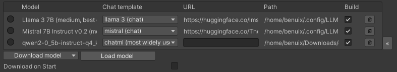

<p align="center">
<picture>
  <source media="(prefers-color-scheme: dark)" srcset=".github/logo_white.png">
  <source media="(prefers-color-scheme: light)" srcset=".github/logo.png">
  
</picture>
</p>

<h3 align="center">Create characters in Unity with LLMs!</h3>

[](https://opensource.org/licenses/MIT)
<a href="https://discord.gg/RwXKQb6zdv"></a>
[](https://www.reddit.com/user/UndreamAI)
[](https://www.linkedin.com/company/undreamai)
[](https://assetstore.unity.com/packages/slug/273604)
[](https://github.com/undreamai/LLMUnity)
[![Documentation](https://img.shields.io/badge/Docs-white.svg?logo=data:image/png;base64,iVBORw0KGgoAAAANSUhEUgAAADAAAAAwEAYAAAAHkiXEAAAABHNCSVQICAgIfAhkiAAAAAlwSFlzAAALEgAACxIB0t1+/AAAABl0RVh0U29mdHdhcmUAd3d3Lmlua3NjYXBlLm9yZ5vuPBoAAATqSURBVHic7ZtbiE1RGMc349K4M5EwklwjzUhJCMmTJPJAYjQXJJcH8+Blkry4lPJA8aAoJbekDLmUS6E8SHJL5AW5JPf77eHv93C22Wfttc/ee+0zc/4vv+bMXvusvfZa3/q+b33H80oqqaSSSmqrKnPdgXjUvbvYq5f4+7f486eb/rRajRsn7t4tPngg/vol/vkj/vghXr0q7tghzpyZ//79+on79omXLombNondukXrd9GoSxdx8mSxqUm8eVNkgAvl0aPioEFip07i6dP52z15Ig4fbvVY2VVFhbhokXjrlogJiWvAg/jwoXjqVO73+leUny9eiFVV5mfMlLDRBw+KX76ISQ+0LZ8/F00v4uJFsWPHFh83O+rdWzx3TnQ9wCZ+/Sqyl5iux1RmTu3aiYcPi64H1pasALypoOv4/8SJXraEbXc9kLbECxo2TKyuFj9/zt9u+XIvG8LWv3wpuh5QW86f3/JznT+fv93s2S23C1Z72wbhtH692LdvMvdPSgzkhAkiJhT16ZO/PRPOmcr+Rda4aa5nclTeuZP7PDgRpr1g40bPrQYOFF0PYKHEC+raVVy8OFy7R49EArvURU4mrUAqaTY0iB8/2rXD+XCm5mbR9QAWylevorV7/VpkL0ld06eLpkiyWPj9u93179+LpFZwZ1PXtGnitWui64GMStPmG7SH1NSIJBNHjvTSFZvRvHlise0N9JcBtW1/44Y4dqx45IjnU0JxAGLpklPx+9VZFwPp/9v/eZDGjxcZh7dv4+mXtch+up7Rca+MsJvxiRNi6nvBhg25HWprZMaPGeOlqxEjxGKz+XGRTAAmyJnq6sR370TXA2NLW+8HNjZ62dLOnaLrAQ1r2zmqPH482n0mTfJCKmEvCJHUooNZE/369Elct06kqiKsONRfulTEFDsX8QDlIa5nup9374pE8IiZHPY+ly+LZE/37/cM6mC6IB6Vl4urV6fzfUG6d0/csyf37wsXRFInaM4ckTjGdPg+apTYs6dI3RIWwH//1DV1qkiuxNY2FzrTd+2y6y8z2HQU6efZs+KBAyJZ4v+V0h6ArlwROaQP0uPH4ooV4sqV8Xz/4MF211M2wwoOq1mzRAq5Pnywa5+4KDHE9mI7ly0TO3fOvZ6/eZCoKwB32HS0SMFV1DNtImBKHYstBROoQ4fEQk2RaS+qrxejmj5M7NatIhWARS82xUJfAKahzFcdPnq0GLYgy7Rnbd8e6rGKRyzpuNzPBQty709RcNSZf/KkuHCh2GpMDyKbGNcLYE+YMkVks336NFx7XhTZ3szXiBaqtWvFuAOxM2dEZiyH8UErgc8JLNun7E0aFffSI7RP6owZmz9kSO73HjsmXr8ukppYsybSYyQvBp5QfOjQ3M9tRR496pGgLf1JtLlzRZJzlFzGp4SWDnUxFCrdvy+uWiWa3DJe3N69oj8uSEq8CER88uaNOGBAOv2ILGY69TBBJoM8O0t72zaRoztXBzlLlrT8XARW/IQq82JTMv3mKmv0/9CC4mJMYPwrMSETxAyurRUxQVmXP1fEid7mzeK3b+n2Jzb16CFu2SIWmtNJiriVxANsyq0uoCJfTk4G9y4t24/bSQ0rTkP6gVTG3mz//uKMGSK/ucId5Xe9lZUi5eMMLGUgz56J5Hxu3xZ50Xg3RMIltVn9BRja26PYsBHgAAAAAElFTkSuQmCC)](https://undream.ai/LLMUnity)

LLM for Unity enables seamless integration of Large Language Models (LLMs) within the Unity engine.<br>
It allows to create intelligent characters that your players can interact with for an immersive experience.<br>
The package also features a Retrieval-Augmented Generation (RAG) system that allows to performs semantic search across your data, which can be used to enhance the character's knowledge.
LLM for Unity is built on top of the awesome [llama.cpp](https://github.com/ggerganov/llama.cpp) library.

<sub>
<a href="#at-a-glance" style="color: black">At a glance</a>&nbsp;&nbsp;•&nbsp;
<a href="#how-to-help" style=color: black>How to help</a>&nbsp;&nbsp;•&nbsp;
<a href="#games-using-llm-for-unity" style=color: black>Games using LLM for Unity</a>&nbsp;&nbsp;•&nbsp;
<a href="#setup" style=color: black>Setup</a>&nbsp;&nbsp;•&nbsp;
<a href="#how-to-use" style=color: black>How to use</a>&nbsp;&nbsp;•&nbsp;
<a href="#semantic-search-with-a-retrieval-augmented-generation-rag-system" style=color: black>RAG</a>&nbsp;&nbsp;•&nbsp;
<a href="#llm-model-management" style=color: black>LLM model management</a>&nbsp;&nbsp;•&nbsp;
<a href="#examples" style=color: black>Examples</a>&nbsp;&nbsp;•&nbsp;
<a href="#options" style=color: black>Options</a>&nbsp;&nbsp;•&nbsp;
<a href="#license" style=color: black>License</a>
</sub>

## At a glance
- 💻 Cross-platform! Windows, Linux, macOS, iOS and Android
- 🏠 Runs locally without internet access. No data ever leave the game!
- ⚡ Blazing fast inference on CPU and GPU (Nvidia, AMD, Apple Metal)
- 🤗 Supports all major LLM models
- 🔧 Easy to setup, call with a single line of code
- 💰 Free to use for both personal and commercial purposes

🧪 Tested on Unity: 2021 LTS, 2022 LTS, 2023, Unity 6<br>
🚦 [Upcoming Releases](https://github.com/orgs/undreamai/projects/2/views/10)

## How to help
- [⭐ Star](https://github.com/undreamai/LLMUnity) the repo, leave us a [review](https://assetstore.unity.com/packages/slug/273604) and spread the word about the project!
- Join us at [Discord](https://discord.gg/RwXKQb6zdv) and say hi.
- [Contribute](CONTRIBUTING.md) by submitting feature requests, bugs or even your own PR.
- [](https://github.com/sponsors/amakropoulos) this work to allow even cooler features!


## Games using LLM for Unity
- [Verbal Verdict](https://store.steampowered.com/app/2778780/Verbal_Verdict/)
- [I, Chatbot: AISYLUM](https://store.epicgames.com/de/p/i-chatbot-aisylum-83b2b5)
- [Nameless Souls of the Void](https://unicorninteractive.itch.io/nameless-souls-of-the-void)
- [Murder in Aisle 4](https://roadedlich.itch.io/murder-in-aisle-4)
- [Finicky Food Delivery AI](https://helixngc7293.itch.io/finicky-food-delivery-ai)
- [AI Emotional Girlfriend](https://whynames.itch.io/aiemotionalgirlfriend)
- [Case Closed](https://store.steampowered.com/app/2532160/Case_Closed)

Contact us to add your project!

## Setup
_Method 1: Install using the asset store_
- Open the [LLM for Unity](https://assetstore.unity.com/packages/slug/273604) asset page and click `Add to My Assets`
- Open the Package Manager in Unity: `Window > Package Manager`
- Select the `Packages: My Assets` option from the drop-down
- Select the `LLM for Unity` package, click `Download` and then `Import`

_Method 2: Install using the GitHub repo:_
- Open the Package Manager in Unity: `Window > Package Manager`
- Click the `+` button and select `Add package from git URL`
- Use the repository URL `https://github.com/undreamai/LLMUnity.git` and click `Add`

## How to use


First you will setup the LLM for your game 🏎:
- Create an empty GameObject.<br>In the GameObject Inspector click `Add Component` and select the LLM script.
- Download one of the default models with the `Download Model` button (~GBs).<br>Or load your own .gguf model with the `Load model` button (see [LLM model management](#llm-model-management)).

Then you can setup each of your characters as follows 🙋‍♀️:
- Create an empty GameObject for the character.<br>In the GameObject Inspector click `Add Component` and select the LLMCharacter script.
- Define the role of your AI in the `Prompt`. You can define the name of the AI (`AI Name`) and the player (`Player Name`).
- (Optional) Select the LLM constructed above in the `LLM` field if you have more than one LLM GameObjects.

You can also adjust the LLM and character settings according to your preference (see [Options](#options)).

In your script you can then use it as follows 🦄:
``` c#
using LLMUnity;

public class MyScript {
  public LLMCharacter llmCharacter;
  
  void HandleReply(string reply){
    // do something with the reply from the model
    Debug.Log(reply);
  }
  
  void Game(){
    // your game function
    ...
    string message = "Hello bot!";
    _ = llmCharacter.Chat(message, HandleReply);
    ...
  }
}
```
You can also specify a function to call when the model reply has been completed.<br>
This is useful if the `Stream` option is enabled for continuous output from the model (default behaviour):
``` c#
  void ReplyCompleted(){
    // do something when the reply from the model is complete
    Debug.Log("The AI replied");
  }
  
  void Game(){
    // your game function
    ...
    string message = "Hello bot!";
    _ = llmCharacter.Chat(message, HandleReply, ReplyCompleted);
    ...
  }
```

To stop the chat without waiting for its completion you can use:
``` c#
    llmCharacter.CancelRequests();
```

- Finally, in the Inspector of the GameObject of your script, select the LLMCharacter GameObject created above as the llmCharacter property.

That's all ✨!
<br><br>
You can also:

<details>
<summary>Build a mobile app</summary>

**iOS**
iOS can be built with the default player settings.

**Android**
On Android you need to specify the `IL2CPP` scripting backend and the `ARM64` as the target architecture in the player settings.<br>
These settings can be accessed from the `Edit > Project Settings` menu within the `Player > Other Settings` section.<br>


Since mobile app sizes are typically small, you can download the LLM models the first time the app launches.
This functionality can be enabled with the `Download on Build` option.
In your project you can wait until the model download is complete with:
``` c#
await LLM.WaitUntilModelSetup();
```
You can also receive calls during the download with the download progress:
``` c#
await LLM.WaitUntilModelSetup(SetProgress);

void SetProgress(float progress){
  string progressPercent = ((int)(progress * 100)).ToString() + "%";
  Debug.Log($"Download progress: {progressPercent}");
}
```
This is useful to present a progress bar or something similar.
The [MobileDemo](Samples~/MobileDemo) is an example application for Android / iOS.

</details>
<details>
<summary>Restrict the output of the LLM / Function calling</summary>

To restrict the output of the LLM you can use a GBNF grammar, read more [here](https://github.com/ggerganov/llama.cpp/tree/master/grammars).<br>
The grammar can be saved in a .gbnf file and loaded at the LLMCharacter with the `Load Grammar` button (Advanced options).<br>
For instance to receive replies in json format you can use the [json.gbnf](https://github.com/ggerganov/llama.cpp/blob/b4218/grammars/json.gbnf) grammar.<br>

Alternatively you can set the grammar directly with code:
``` c#
llmCharacter.grammarString = "your grammar here";
```

For function calling you can define similarly a grammar that allows only the function names as output, and then call the respective function.<br>
You can look into the [FunctionCalling](Samples~/FunctionCalling) sample for an example implementation.

</details>
<details>
<summary>Access / Save / Load your chat history</summary>
The chat history of a `LLMCharacter` is retained in the `chat` variable that is a list of `ChatMessage` objects.<br>
The ChatMessage is a struct that defines the `role` of the message and the `content`.<br>
The first element of the list is always the system prompt and then alternating messages with the player prompt and the AI reply.<br>
You can modify the chat history directly in this list.<br>

To automatically save / load your chat history, you can specify the `Save` parameter of the LLMCharacter to the filename (or relative path) of your choice.
The file is saved in the [persistentDataPath folder of Unity](https://docs.unity3d.com/ScriptReference/Application-persistentDataPath.html).
This also saves the state of the LLM which means that the previously cached prompt does not need to be recomputed.

To manually save your chat history, you can use:
``` c#
    llmCharacter.Save("filename");
```
and to load the history:
``` c#
    llmCharacter.Load("filename");
```
where filename the filename or relative path of your choice.

</details>
<details>
<summary>Process the prompt at the beginning of your app for faster initial processing time</summary>

``` c#
  void WarmupCompleted(){
    // do something when the warmup is complete
    Debug.Log("The AI is nice and ready");
  }

  void Game(){
    // your game function
    ...
    _ = llmCharacter.Warmup(WarmupCompleted);
    ...
  }
```

</details>
<details>
<summary>Decide whether or not to add the message to the chat/prompt history</summary>

  The last argument of the `Chat` function is a boolean that specifies whether to add the message to the history (default: true):
``` c#
  void Game(){
    // your game function
    ...
    string message = "Hello bot!";
    _ = llmCharacter.Chat(message, HandleReply, ReplyCompleted, false);
    ...
  }
```

</details>
<details>
<summary>Use pure text completion</summary>

``` c#
  void Game(){
    // your game function
    ...
    string message = "The cat is away";
    _ = llmCharacter.Complete(message, HandleReply, ReplyCompleted);
    ...
  }
```

</details>
<details>
<summary>Wait for the reply before proceeding to the next lines of code</summary>

  For this you can use the `async`/`await` functionality:
``` c#
  async void Game(){
    // your game function
    ...
    string message = "Hello bot!";
    string reply = await llmCharacter.Chat(message, HandleReply, ReplyCompleted);
    Debug.Log(reply);
    ...
  }
```

</details>
<details>
<summary>Add a LLM / LLMCharacter component programmatically</summary>

``` c#
using UnityEngine;
using LLMUnity;

public class MyScript : MonoBehaviour
{
    LLM llm;
    LLMCharacter llmCharacter;

    async void Start()
    {
        // disable gameObject so that theAwake is not called immediately
        gameObject.SetActive(false);

        // Add an LLM object
        llm = gameObject.AddComponent<LLM>();
        // set the model using the filename of the model.
        // The model needs to be added to the LLM model manager (see LLM model management) by loading or downloading it.
        // Otherwise the model file can be copied directly inside the StreamingAssets folder.
        llm.SetModel("Phi-3-mini-4k-instruct-q4.gguf");
        // optional: you can also set loras in a similar fashion and set their weights (if needed)
        llm.AddLora("my-lora.gguf");
        llm.SetLoraWeight(0.5f);
        // optional: you can set the chat template of the model if it is not correctly identified
        // You can find a list of chat templates in the ChatTemplate.templates.Keys
        llm.SetTemplate("phi-3");
        // optional: set number of threads
        llm.numThreads = -1;
        // optional: enable GPU by setting the number of model layers to offload to it
        llm.numGPULayers = 10;

        // Add an LLMCharacter object
        llmCharacter = gameObject.AddComponent<LLMCharacter>();
        // set the LLM object that handles the model
        llmCharacter.llm = llm;
        // set the character prompt
        llmCharacter.SetPrompt("A chat between a curious human and an artificial intelligence assistant.");
        // set the AI and player name
        llmCharacter.AIName = "AI";
        llmCharacter.playerName = "Human";
        // optional: set streaming to false to get the complete result in one go
        // llmCharacter.stream = true;
        // optional: set a save path
        // llmCharacter.save = "AICharacter1";
        // optional: enable the save cache to avoid recomputation when loading a save file (requires ~100 MB)
        // llmCharacter.saveCache = true;
        // optional: set a grammar
        // await llmCharacter.SetGrammar("json.gbnf");

        // re-enable gameObject
        gameObject.SetActive(true);
    }
}
```

</details>
<details>
<summary>Use a remote server</summary>

You can use a remote server to carry out the processing and implement characters that interact with it.

**Create the server**<br>
To create the server:
- Create a project with a GameObject using the `LLM` script as described above
- Enable the `Remote` option of the `LLM` and optionally configure the server parameters: port, API key, SSL certificate, SSL key
- Build and run to start the server

Alternatively you can use a server binary for easier deployment:
- Run the above scene from the Editor and copy the command from the Debug messages (starting with "Server command:")
- Download the [server binaries](https://github.com/undreamai/LlamaLib/releases/download/v1.1.12/undreamai-v1.1.12-server.zip) and [DLLs](https://github.com/undreamai/LlamaLib/releases/download/v1.1.12/undreamai-v1.1.12-llamacpp-full.zip) and extract them into the same folder
- Find the architecture you are interested in from the folder above e.g. for Windows and CUDA use the `windows-cuda-cu12.2.0`.<br>You can also check the architecture that works for your system from the Debug messages (starting with "Using architecture").
- From command line change directory to the architecture folder selected and start the server by running the command copied from above.

**Create the characters**<br>
Create a second project with the game characters using the `LLMCharacter` script as described above.
Enable the `Remote` option and configure the host with the IP address (starting with "http://") and port of the server.

</details>
<details>
<summary>Compute embeddings using a LLM</summary>

The `Embeddings` function can be used to obtain the emdeddings of a phrase:
``` c#
    List<float> embeddings = await llmCharacter.Embeddings("hi, how are you?");
```

</details>

A <b>detailed documentation</b> on function level can be found here:
<a href="https://undream.ai/LLMUnity"></a>

## Semantic search with a Retrieval-Augmented Generation (RAG) system
LLM for Unity implements a super-fast similarity search functionality with a Retrieval-Augmented Generation (RAG) system.<br>
It is based on the LLM functionality, and the Approximate Nearest Neighbors (ANN) search from the [usearch](https://github.com/unum-cloud/usearch) library.<br>
Semantic search works as follows.

**Building the data** You provide text inputs (a phrase, paragraph, document) to add to the data.<br>
Each input is split into chunks (optional) and encoded into embeddings with a LLM.

**Searching** You can then search for a query text input. <br>
The input is again encoded and the most similar text inputs or chunks in the data are retrieved.

To use semantic serch:
- create a GameObject for the LLM as described above. Download one of the provided RAG models or load your own (good options can be found at the [MTEB leaderboard](https://huggingface.co/spaces/mteb/leaderboard)).
- create an empty GameObject. In the GameObject Inspector click `Add Component` and select the `RAG` script.
- In the Search Type dropdown of the RAG select your preferred search method. `SimpleSearch` is a simple brute-force search, while`DBSearch` is a fast ANN method that should be preferred in most cases.
- In the Chunking Type dropdown of the RAG you can select a method for splitting the inputs into chunks. This is useful to have a more consistent meaning within each data part. Chunking methods for splitting according to tokens, words and sentences are provided.

Alternatively, you can create the RAG from code (where llm is your LLM):
``` c#
  RAG rag = gameObject.AddComponent<RAG>();
  rag.Init(SearchMethods.DBSearch, ChunkingMethods.SentenceSplitter, llm);
```

In your script you can then use it as follows :unicorn::
``` c#
using LLMUnity;

public class MyScript : MonoBehaviour
{
  RAG rag;

  async void Game(){
    ...
    string[] inputs = new string[]{
      "Hi! I'm a search system.",
      "the weather is nice. I like it.",
      "I'm a RAG system"
    };
    // add the inputs to the RAG
    foreach (string input in inputs) await rag.Add(input);
    // get the 2 most similar inputs and their distance (dissimilarity) to the search query
    (string[] results, float[] distances) = await rag.Search("hello!", 2);
    // to get the most similar text parts (chnuks) you can enable the returnChunks option
    rag.ReturnChunks(true);
    (results, distances) = await rag.Search("hello!", 2);
    ...
  }
}
```

You can also add / search text inputs for groups of data e.g. for a specific character or scene:
``` c#
    // add the inputs to the RAG for a group of data e.g. an orc character
    foreach (string input in inputs) await rag.Add(input, "orc");
    // get the 2 most similar inputs for the group of data e.g. the orc character
    (string[] results, float[] distances) = await rag.Search("how do you feel?", 2, "orc");
...

You can save the RAG state (stored in the `Assets/StreamingAssets` folder):
``` c#
rag.Save("rag.zip");
```
and load it from disk:
``` c#
await rag.Load("rag.zip");
```

You can use the RAG to feed relevant data to the LLM based on a user message:
``` c#
  string message = "How is the weather?";
  (string[] similarPhrases, float[] distances) = await rag.Search(message, 3);

  string prompt = "Answer the user query based on the provided data.\n\n";
  prompt += $"User query: {message}\n\n";
  prompt += $"Data:\n";
  foreach (string similarPhrase in similarPhrases) prompt += $"\n- {similarPhrase}";

  _ = llmCharacter.Chat(prompt, HandleReply, ReplyCompleted);
```

The `RAG` sample includes an example RAG implementation as well as an example RAG-LLM integration.

That's all :sparkles:!

## LLM model management
LLM for Unity uses a model manager that allows to load or download LLMs and ship them directly in your game.<br>
The model manager can be found as part of the LLM GameObject:<br>


You can download models with the `Download model` button.<br>
LLM for Unity includes different state of the art models built-in for different model sizes, quantised with the Q4_K_M method.<br>
Alternative models can be downloaded from [HuggingFace](https://huggingface.co/models?library=gguf&sort=downloads) in the .gguf format.<br>
You can download a model locally and load it with the `Load model` button, or copy the URL in the `Download model > Custom URL` field to directly download it.<br>
If a HuggingFace model does not provide a gguf file, it can be converted to gguf with this [online converter](https://huggingface.co/spaces/ggml-org/gguf-my-repo).<br>

The chat template used for constructing the prompts is determined automatically from the model (if a relevant entry exists) or the model name. <br>
If incorrecly identified, you can select another template from the chat template dropdown.<br>
<br>
Models added in the model manager are copied to the game during the building process.<br>
You can omit a model from being built in by deselecting the "Build" checkbox.<br>
To remove the model (but not delete it from disk) you can click the bin button.<br>
The the path and URL (if downloaded) of each added model is diplayed in the expanded view of the model manager access with the `>>` button:<br>


You can create lighter builds by selecting the `Download on Build` option.<br>
Using this option the models will be downloaded the first time the game starts instead of copied in the build.<br>
If you have loaded a model locally you need to set its URL through the expanded view, otherwise it will be copied in the build.<br>

❕ Before using any model make sure you **check their license** ❕

## Examples
The [Samples~](Samples~) folder contains several examples of interaction 🤖:
- [SimpleInteraction](Samples~/SimpleInteraction): Simple interaction with an AI character
- [MultipleCharacters](Samples~/MultipleCharacters): Simple interaction using multiple AI characters
- [FunctionCalling](Samples~/FunctionCalling): Function calling sample with structured output from the LLM
- [RAG](Samples~/RAG): Semantic search using a Retrieval Augmented Generation (RAG) system. Includes example using a RAG to feed information to a LLM
- [MobileDemo](Samples~/MobileDemo): Example mobile app for Android / iOS with an initial screen displaying the model download progress
- [ChatBot](Samples~/ChatBot): Interaction between a player and a AI with a UI similar to a messaging app (see image below)
- [KnowledgeBaseGame](Samples~/KnowledgeBaseGame): Simple detective game using a knowledge base to provide information to the LLM based on [google/mysteryofthreebots](https://github.com/google/mysteryofthreebots)
  


To install a sample:
- Open the Package Manager: `Window > Package Manager`
- Select the `LLM for Unity` Package. From the `Samples` Tab, click `Import` next to the sample you want to install.

The samples can be run with the `Scene.unity` scene they contain inside their folder.<br>
In the scene, select the `LLM` GameObject and click the `Download Model` button to download a default model or `Load model` to load your own model (see [LLM model management](#llm-model-management)).<br>
Save the scene, run and enjoy!

## Options

### LLM Settings

- `Show/Hide Advanced Options` Toggle to show/hide advanced options from below
- `Log Level` select how verbose the log messages are
- `Use extras` select to install and allow the use of extra features (flash attention and IQ quants)

#### 💻 Setup Settings

<div>

</div>

- `Remote` select to provide remote access to the LLM
- `Port` port to run the LLM server (if `Remote` is set)
- `Num Threads` number of threads to use (default: -1 = all)
- `Num GPU Layers` number of model layers to offload to the GPU.
If set to 0 the GPU is not used. Use a large number i.e. >30 to utilise the GPU as much as possible.
Note that higher values of context size will use more VRAM.
If the user's GPU is not supported, the LLM will fall back to the CPU
- `Debug` select to log the output of the model in the Unity Editor
- <details><summary>Advanced options</summary>

  - <details><summary><code>Parallel Prompts</code> number of prompts / slots that can happen in parallel (default: -1 = number of LLMCharacter objects). Note that the context size is divided among the slots.</summary> If you want to retain as much context for the LLM and don't need all the characters present at the same time, you can set this number and specify the slot for each LLMCharacter object.
  e.g. Setting `Parallel Prompts` to 1 and slot 0 for all LLMCharacter objects will use the full context, but the entire prompt will need to be computed (no caching) whenever a LLMCharacter object is used for chat. </details>
  - `Dont Destroy On Load` select to not destroy the LLM GameObject when loading a new Scene

</details>

### Server Security Settings

- `API key` API key to use to allow access to requests from LLMCharacter objects (if `Remote` is set)
- <details><summary>Advanced options</summary>

  - `Load SSL certificate` allows to load a SSL certificate for end-to-end encryption of requests (if `Remote` is set). Requires SSL key as well.
  - `Load SSL key` allows to load a SSL key for end-to-end encryption of requests (if `Remote` is set). Requires SSL certificate as well.
  - `SSL certificate path` the SSL certificate used for end-to-end encryption of requests (if `Remote` is set).
  - `SSL key path` the SSL key used for end-to-end encryption of requests (if `Remote` is set).

</details>

#### 🤗 Model Settings
- `Download model` click to download one of the default models
- `Load model` click to load your own model in .gguf format
- `Download on Start` enable to downloaded the LLM models the first time the game starts. Alternatively the LLM models wil be copied directly in the build
- <details><summary><code>Context Size</code> size of the prompt context (0 = context size of the model)</summary> This is the number of tokens the model can take as input when generating responses. Higher values use more RAM or VRAM (if using GPU). </details>

- <details><summary>Advanced options</summary>

  - `Download lora` click to download a LoRA model in .gguf format
  - `Load lora` click to load a LoRA model in .gguf format
  - `Batch Size` batch size for prompt processing (default: 512)
  - `Model` the path of the model being used (relative to the Assets/StreamingAssets folder)
  - `Chat Template` the chat template being used for the LLM
  - `Lora` the path of the LoRAs being used (relative to the Assets/StreamingAssets folder)
  - `Lora Weights` the weights of the LoRAs being used
  - `Flash Attention` click to use flash attention in the model (if `Use extras` is enabled)

</details>

### LLMCharacter Settings

- `Show/Hide Advanced Options` Toggle to show/hide advanced options from below
- `Log Level` select how verbose the log messages are
- `Use extras` select to install and allow the use of extra features (flash attention and IQ quants)

#### 💻 Setup Settings
<div>

</div>

- `Remote` whether the LLM used is remote or local
- `LLM` the LLM GameObject (if `Remote` is not set)
- `Hort` ip of the LLM server (if `Remote` is set)
- `Port` port of the LLM server (if `Remote` is set)
- `Num Retries` number of HTTP request retries from the LLM server (if `Remote` is set)
- `API key` API key of the LLM server (if `Remote` is set)
- <details><summary><code>Save</code> save filename or relative path</summary> If set, the chat history and LLM state (if save cache is enabled) is automatically saved to file specified. <br> The chat history is saved with a json suffix and the LLM state with a cache suffix. <br> Both files are saved in the [persistentDataPath folder of Unity](https://docs.unity3d.com/ScriptReference/Application-persistentDataPath.html).</details>
- `Save Cache` select to save the LLM state along with the chat history. The LLM state is typically around 100MB+.
- `Debug Prompt` select to log the constructed prompts in the Unity Editor

#### 🗨️ Chat Settings
- `Player Name` the name of the player
- `AI Name` the name of the AI
- `Prompt` description of the AI role

#### 🤗 Model Settings
- `Stream` select to receive the reply from the model as it is produced (recommended!).<br>
If it is not selected, the full reply from the model is received in one go
- <details><summary><code>Num Predict</code> maximum number of tokens to predict (default: 256, -1 = infinity, -2 = until context filled)</summary>This is the maximum amount of tokens the model will maximum predict. When N tokens are reached the model will stop generating. This means words / sentences might not get finished if this is too low. </details>

- <details><summary>Advanced options</summary>

  - `Load grammar` click to load a grammar in .gbnf format
  - `Grammar` the path of the grammar being used (relative to the Assets/StreamingAssets folder)
  - <details><summary><code>Cache Prompt</code> save the ongoing prompt from the chat (default: true)</summary> Saves the prompt while it is being created by the chat to avoid reprocessing the entire prompt every time</details>
  - `Slot` slot of the server to use for computation. Value can be set from 0 to `Parallel Prompts`-1 (default: -1 = new slot for each character)
  - `Seed` seed for reproducibility. For random results every time use -1
  - <details><summary><code>Temperature</code> LLM temperature, lower values give more deterministic answers (default: 0.2)</summary>The temperature setting adjusts how random the generated responses are. Turning it up makes the generated choices more varied and unpredictable. Turning it down makes the generated responses more predictable and focused on the most likely options.</details>
  - <details><summary><code>Top K</code> top-k sampling (default: 40, 0 = disabled)</summary>The top k value controls the top k most probable tokens at each step of generation. This value can help fine tune the output and make this adhere to specific patterns or constraints.</details>
  - <details><summary><code>Top P</code> top-p sampling (default: 0.9, 1.0 = disabled)</summary>The top p value controls the cumulative probability of generated tokens. The model will generate tokens until this theshold (p) is reached. By lowering this value you can shorten output & encourage / discourage more diverse outputs.</details>
  - <details><summary><code>Min P</code> minimum probability for a token to be used (default: 0.05)</summary> The probability is defined relative to the probability of the most likely token.</details>
  - <details><summary><code>Repeat Penalty</code> control the repetition of token sequences in the generated text (default: 1.1)</summary>The penalty is applied to repeated tokens.</details>
  - <details><summary><code>Presence Penalty</code> repeated token presence penalty (default: 0.0, 0.0 = disabled)</summary> Positive values penalize new tokens based on whether they appear in the text so far, increasing the model's likelihood to talk about new topics.</details>
  - <details><summary><code>Frequency Penalty</code> repeated token frequency penalty (default: 0.0, 0.0 = disabled)</summary> Positive values penalize new tokens based on their existing frequency in the text so far, decreasing the model's likelihood to repeat the same line verbatim.</details>
  - `Tfs_z`: enable tail free sampling with parameter z (default: 1.0, 1.0 = disabled).
  - `Typical P`: enable locally typical sampling with parameter p (default: 1.0, 1.0 = disabled).
  - `Repeat Last N`: last N tokens to consider for penalizing repetition (default: 64, 0 = disabled, -1 = ctx-size).
  - `Penalize Nl`: penalize newline tokens when applying the repeat penalty (default: true).
  - `Penalty Prompt`: prompt for the purpose of the penalty evaluation. Can be either `null`, a string or an array of numbers representing tokens (default: `null` = use original `prompt`).
  - `Mirostat`: enable Mirostat sampling, controlling perplexity during text generation (default: 0, 0 = disabled, 1 = Mirostat, 2 = Mirostat 2.0).
  - `Mirostat Tau`: set the Mirostat target entropy, parameter tau (default: 5.0).
  - `Mirostat Eta`: set the Mirostat learning rate, parameter eta (default: 0.1).
  - `N Probs`: if greater than 0, the response also contains the probabilities of top N tokens for each generated token (default: 0)
  - `Ignore Eos`: enable to ignore end of stream tokens and continue generating (default: false).

</details>

## License
The license of LLM for Unity is MIT ([LICENSE.md](LICENSE.md)) and uses third-party software with MIT and Apache licenses.
Some models included in the asset define their own license terms, please review them before using each model.
Third-party licenses can be found in the ([Third Party Notices.md](<Third Party Notices.md>)).
